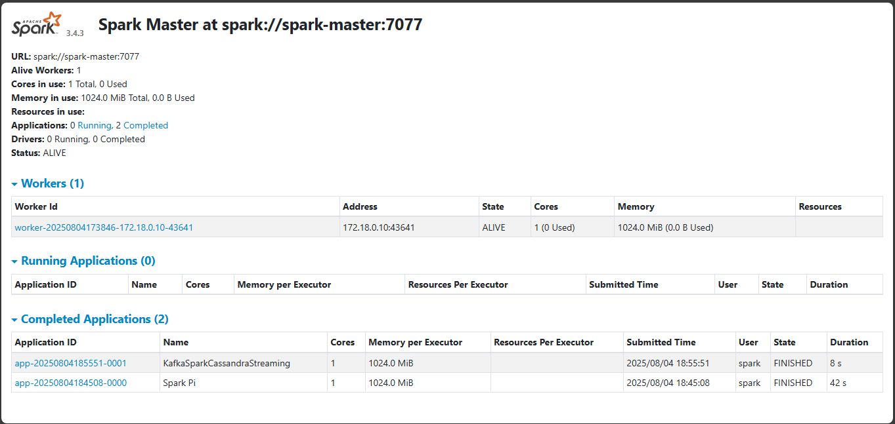

# Real-Time Data Pipeline

This project implements a real-time data streaming pipeline that ingests data from an external API, orchestrates workflows using Apache Airflow, and leverages Apache Kafka for reliable message queuing and decoupling between data producers and consumers. Incoming data is first stored in PostgreSQL for backup or auditing purposes, then published to Kafka topics. Kafka integrates with the Confluent Schema Registry to ensure consistent message formats, and its operations are monitored via the Kafka Control Center. Apache Spark, running in a distributed setup with master and worker nodes, subscribes to the Kafka topics to process, transform, and enrich the streaming data. The processed data is then stored in Cassandra, a high-performance NoSQL database optimized for real-time reads and writes. ZooKeeper manages the Kafka brokers, ensuring high availability and coordination. The entire system is containerized using Docker, enabling easy deployment, environment consistency, and scalability.

## 🏗️ Architecture


This project implements a complete ETL (Extract, Transform, Load) pipeline where:
1. API data is pulled by Airflow DAGs.
2. Airflow writes data to PostgreSQL (backup) and pushes it to Kafka topics.
3. Kafka broadcasts the data to Spark for processing.
4. Spark processes, transforms and pushes final results to Cassandra for querying or dashboarding.
5. Schema Registry ensures all Kafka messages conform to an agreed format.
6. Control Center and ZooKeeper manage and monitor the Kafka ecosystem.
7. Everything runs on Docker, simplifying deployment

## 🛠️ Tech Stack

- **🔄 Apache Airflow** - Workflow orchestration and scheduling
- **🐘 PostgreSQL**- Relational backup and source of truth for incoming data
- **📨 Apache Kafka** - Real-time data streaming
- **🗄️ Apache Cassandra** - NoSQL database for storage
- **⚡ Apache Spark** - Distributed data processing (cluster ready)
- **🐳 Docker** - Containerization and orchestration
- **🐍 Python** - Data processing and consumer logic

## 🚀 Quick Start

### Prerequisites
- Docker and Docker Compose
- 8GB+ RAM recommended
- Ports 8082, 9021, 8083, 9042 available

### 1. Clone Repository
```bash
git clone https://github.com/Peter-Opapa/kafka_airflow_cassandra_pipeline.git
cd kafka_airflow_cassandra_pipeline
```

### 2. Start the Pipeline
```bash
docker-compose up -d
```

### 3. Wait for Services (2-3 minutes)
All services need time to initialize. Monitor with:
```bash
docker-compose ps
```

### 4. Access Web UIs

| Service | URL | Purpose |
|---------|-----|---------|
| **Airflow** | [http://localhost:8082](http://localhost:8082) | Pipeline orchestration |
| **Kafka Control Center** | [http://localhost:9021](http://localhost:9021) | Stream monitoring |
| **Spark Master** | [http://localhost:8083](http://localhost:8083) | Cluster management |

**Airflow Credentials:**
- Username: `admin`
- Password: `yk3DNHKWbWCHnzQV`

## 📊 Web UI Screenshots

### Airflow - Pipeline Orchestration

*Monitor DAG runs, task execution, and pipeline health*

### Kafka Control Center - Stream Monitoring  

*Real-time monitoring of Kafka topics, consumers, and message flow*

### Spark - Cluster Management

*Monitor Spark jobs, executors, and cluster resources*

## 🔄 Data Flow

1. **Data Generation**: Airflow DAG fetches user profiles from RandomUser API
2. **Message Publishing**: User data is published to Kafka topic `users_created`
3. **Stream Processing**: Python consumer processes messages in real-time
4. **Data Storage**: Processed records are stored in Cassandra `created_users` table

## 📁 Project Structure

```
.
├── docker-compose.yml         # Infrastructure orchestration
├── requirements.txt          # Python dependencies
├── dags/
│   └── kafka_stream.py       # Airflow DAG for data ingestion
├── src/
│   ├── simple_stream.py      # Kafka-to-Cassandra consumer
│   └── debug_pipeline.ps1    # Pipeline debugging script
├── docs/
│   └── images/               # UI screenshots and diagrams
├── logs/                     # Airflow logs
├── plugins/                  # Airflow plugins
└── script/                   # Initialization scripts
```

## 🗄️ Database Schema

### Cassandra Table: `spark_streams.created_users`
```sql
CREATE TABLE created_users (
    id UUID PRIMARY KEY,
    first_name TEXT,
    last_name TEXT,
    gender TEXT,
    email TEXT,
    username TEXT,
    phone TEXT,
    address TEXT,
    post_code TEXT,
    dob TIMESTAMP,
    registered_date TIMESTAMP,
    picture TEXT,
    timestamp TIMESTAMP
);
```

## 🏃‍♂️ Running the Consumer

The data consumer runs automatically, but you can also run it manually:

```bash
# Copy consumer to Spark container
docker cp src/simple_stream.py spark-master:/simple_stream.py

# Install dependencies
docker exec spark-master pip install kafka-python cassandra-driver

# Run consumer
docker exec spark-master python /simple_stream.py
```

## 📈 Monitoring & Verification

### Check Data Flow
```bash
# Verify Kafka messages
docker exec broker kafka-console-consumer --bootstrap-server localhost:9092 --topic users_created --from-beginning --max-messages 5

# Check Cassandra data
docker exec cassandra cqlsh -e "SELECT COUNT(*) FROM spark_streams.created_users;"

# View sample records
docker exec cassandra cqlsh -e "SELECT first_name, last_name, email FROM spark_streams.created_users LIMIT 5;"
```

### Container Health
```bash
docker-compose ps
docker-compose logs [service-name]
```

## 🛠️ Services Configuration

| Service | Container | Port | Description |
|---------|-----------|------|-------------|
| Zookeeper | zookeeper | 2181 | Kafka coordination |
| Kafka Broker | broker | 9092, 29092 | Message streaming |
| Schema Registry | schema-registry | 8081 | Schema management |
| Control Center | control-center | 9021 | Kafka monitoring |
| Airflow | airflow-webserver | 8082 | Workflow management |
| Postgres | postgres | 5432 | Airflow metadata |
| Spark Master | spark-master | 8083 | Cluster coordination |
| Spark Worker | spark-worker | 8084 | Task execution |
| Cassandra | cassandra | 9042 | Data storage |

## 🔧 Troubleshooting

### Common Issues

1. **Port Conflicts**: Ensure ports 8082, 9021, 8083, 9042 are free
2. **Memory Issues**: Increase Docker memory allocation to 8GB+
3. **Startup Time**: Allow 2-3 minutes for all services to initialize
4. **Network Issues**: All services use `kafka_confluent` Docker network

### Debug Commands
```bash
# Check all containers
docker-compose ps

# View service logs
docker-compose logs airflow-webserver
docker-compose logs broker
docker-compose logs cassandra

# Restart specific service
docker-compose restart [service-name]

# Clean restart
docker-compose down
docker-compose up -d
```

## 🚦 Pipeline Health Check

Run the debugging script to verify end-to-end flow:
```bash
# Windows PowerShell
.\src\debug_pipeline.ps1

# Linux/Mac (convert script)
bash src/debug_pipeline.sh
```

## 📊 Performance Metrics

- **Throughput**: ~1 message/minute (configurable in Airflow DAG)
- **Latency**: <1 second from Kafka to Cassandra
- **Scalability**: Horizontally scalable with additional Spark workers
- **Reliability**: Automatic retry logic and error handling

## 🤝 Contributing

1. Fork the repository
2. Create feature branch (`git checkout -b feature/amazing-feature`)
3. Commit changes (`git commit -m 'Add amazing feature'`)
4. Push to branch (`git push origin feature/amazing-feature`)
5. Open Pull Request

## 📝 License

This project is licensed under the MIT License - see the [LICENSE](LICENSE) file for details.

## 🔗 Useful Links

- [Apache Airflow Documentation](https://airflow.apache.org/)
- [Apache Kafka Documentation](https://kafka.apache.org/)
- [Apache Cassandra Documentation](https://cassandra.apache.org/)
- [Confluent Platform Documentation](https://docs.confluent.io/)

---

**⭐ If you find this project helpful, please give it a star!**
