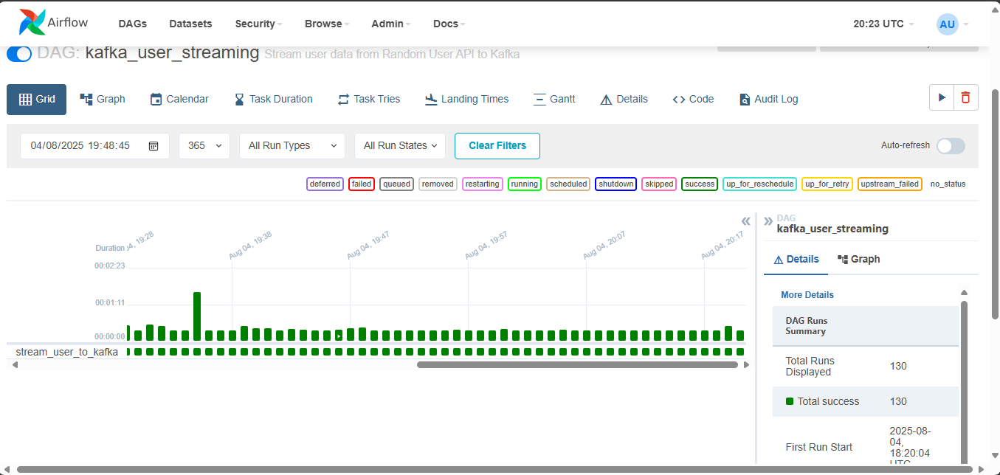
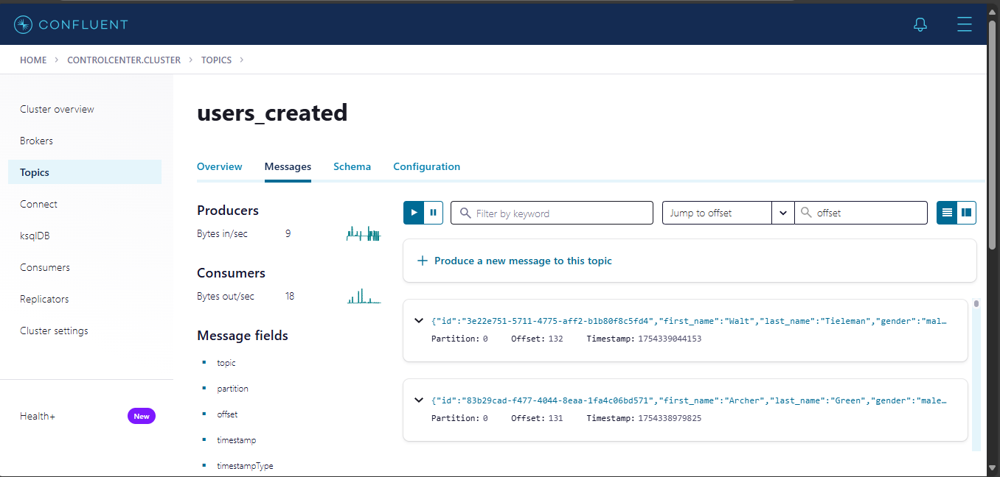
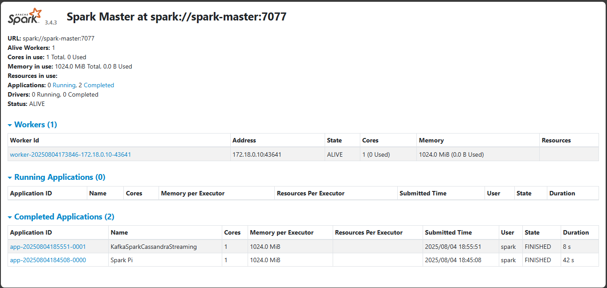

# Web UI Access Guide

This guide explains how to access and use the various web interfaces in the Real-Time Data Pipeline.

## 🖥️ Web Interfaces Overview

### 1. Apache Airflow - Pipeline Orchestration
- **URL**: [http://localhost:8082](http://localhost:8082)
- **Purpose**: Monitor and manage data pipeline workflows
- **Login Credentials**:
  - Username: `admin`
  - Password: `yk3DNHKWbWCHnzQV`

#### Key Features:
- View DAG execution status
- Monitor task performance
- Trigger manual pipeline runs
- View logs and error details
- Manage pipeline schedules

### 2. Confluent Control Center - Kafka Monitoring
- **URL**: [http://localhost:9021](http://localhost:9021)
- **Purpose**: Monitor Kafka topics, consumers, and message flow
- **No Authentication Required**

#### Key Features:
- Monitor topic `users_created`
- View message throughput and latency
- Inspect message content
- Monitor consumer group `python_consumer_group_v2`
- Track cluster health

### 3. Apache Spark Master - Cluster Management
- **URL**: [http://localhost:8083](http://localhost:8083)
- **Purpose**: Monitor Spark cluster and job execution
- **No Authentication Required**

#### Key Features:
- View cluster resources
- Monitor worker nodes
- Track job execution history
- View application logs
- Monitor executor performance

### 4. Apache Spark Worker - Worker Node Details
- **URL**: [http://localhost:8084](http://localhost:8084)
- **Purpose**: Detailed view of individual worker node
- **No Authentication Required**

#### Key Features:
- Worker resource utilization
- Running executor details
- Task execution logs
- Worker node health

## 🚀 Accessing UIs from GitHub

### For GitHub Repository Visitors:

1. **Clone the repository**:
   ```bash
   git clone https://github.com/yourusername/realtime-data-pipeline.git
   cd realtime-data-pipeline
   ```

2. **Start the pipeline**:
   ```bash
   docker-compose up -d
   ```

3. **Wait for initialization** (2-3 minutes):
   ```bash
   docker-compose ps
   ```

4. **Access the UIs** using the URLs above

### Quick Start Script:
```bash
#!/bin/bash
# Quick start script for new users
echo "Starting Real-Time Data Pipeline..."
docker-compose up -d

echo "Waiting for services to initialize..."
sleep 180

echo "🎉 Pipeline is ready!"
echo "🌐 Access the UIs:"
echo "  • Airflow: http://localhost:8082 (admin/yk3DNHKWbWCHnzQV)"
echo "  • Kafka Control Center: http://localhost:9021"
echo "  • Spark Master: http://localhost:8083"
echo "  • Spark Worker: http://localhost:8084"
```

## 📊 What You'll See in Each UI

### Airflow Web UI


**Expected Views**:
- DAG `user_automation` running every minute
- Green task instances indicating successful execution
- Logs showing successful API calls and Kafka publishing

### Kafka Control Center


**Expected Views**:
- Topic `users_created` with increasing message count
- Consumer group `python_consumer_group_v2` actively consuming
- Steady message throughput (1 message/minute)

### Spark Web UI


**Expected Views**:
- Master and worker nodes online
- Available cores and memory
- Application history (if Spark jobs have run)

## 🔧 Troubleshooting UI Access

### Common Issues:

1. **Port Already in Use**:
   ```bash
   # Check what's using the port
   netstat -tulpn | grep :8082
   
   # Kill the process or change port in docker-compose.yml
   ```

2. **Services Not Ready**:
   ```bash
   # Check service status
   docker-compose ps
   
   # View service logs
   docker-compose logs airflow-webserver
   ```

3. **Cannot Access from Remote Machine**:
   - Change `localhost` to your machine's IP address
   - Ensure firewall allows the ports
   - For cloud deployment, configure security groups

4. **Airflow Login Issues**:
   - Ensure you're using the correct credentials
   - Wait for Airflow to fully initialize (may take 2-3 minutes)
   - Check logs: `docker-compose logs airflow-webserver`

### Verification Commands:

```bash
# Check all services are running
docker-compose ps

# Test UI endpoints
curl -I http://localhost:8082  # Airflow
curl -I http://localhost:9021  # Kafka Control Center
curl -I http://localhost:8083  # Spark Master

# Check data flow
docker exec broker kafka-console-consumer --bootstrap-server localhost:9092 --topic users_created --max-messages 1

# Verify data in Cassandra
docker exec cassandra cqlsh -e "SELECT COUNT(*) FROM spark_streams.created_users;"
```

## 🌐 Cloud Deployment Access

### AWS EC2 / Azure VM / GCP Compute:
1. Update docker-compose.yml to bind to `0.0.0.0` instead of `localhost`
2. Configure security groups to allow inbound traffic on ports 8082, 9021, 8083, 8084
3. Access via: `http://YOUR_PUBLIC_IP:PORT`

### Docker Swarm / Kubernetes:
- Use ingress controllers or load balancers
- Configure proper service exposure
- Set up authentication for production environments

## 📱 Mobile Access

All UIs are responsive and can be accessed from mobile devices using the same URLs. For best experience:
- Use landscape mode for dashboards
- Zoom in for detailed views
- Use native browser for full functionality

## 🔐 Security Considerations

### Production Deployments:
- Change default Airflow password
- Enable HTTPS/TLS
- Configure authentication (LDAP, OAuth)
- Use reverse proxy (nginx, traefik)
- Implement network security (VPN, private networks)
- Regular security updates

### Development/Demo:
- Current configuration suitable for local development
- Not recommended for production without security hardening
- Consider using Docker secrets for sensitive data

---

**💡 Tip**: Bookmark these URLs for quick access during development!
